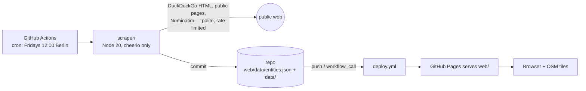

# Body Map

Body Map is a single-page map of the social-dance world — **tango, salsa,
bachata and kizomba** — showing socials (milongas), marathons, festivals and
classes on a full-screen Leaflet + OpenStreetMap view. The dataset is a plain
JSON file committed to this repo; a polite, search-driven scraper (GitHub
Actions, weekly on Fridays) discovers new entities per dance, refreshes known
ones, and commits every change with a full audit trail. There is no backend,
no database server and no account with any third party — the repo *is* the
app. `CONTRACT.md` is the binding spec for everything here.

## Features

- **Four dances, one switcher** — a floating circle button over the map
  (showing the active dance's initial) switches between tango, salsa, bachata
  and kizomba (single-select dropdown). The choice lives in the URL hash
  (`#dance=salsa`, shareable) and in `localStorage` (`bodymap.dance`); at
  load, hash wins over storage wins over the default (tango). An entity may
  belong to several dances (`dances` array — e.g. a salsa+bachata school).
- **Multi-select category tabs** — one pill per category with a color dot and
  a live count of visible entities; toggle any combination, all on by default.
  The `social` label is dance-aware: **Milongas** while tango is active,
  **Socials** for every other dance.
- **Four categories, four colors** (defined in `web/js/categories.js` and as
  CSS custom properties `--cat-*` in `web/css/style.css`):

  | key | label (tango) | label (other dances) | color |
  |---|---|---|---|
  | `social` | Milongas | Socials | `#F2B134` warm yellow |
  | `marathon` | Marathons | Marathons | `#7A1E2B` bordeaux |
  | `festival` | Festivals | Festivals | `#6F2DA8` grape purple |
  | `class` | Classes | Classes | `#2B5FD9` cobalt blue |

- **Date strip** — a horizontally scrollable strip of day chips under the
  tabs, month by month with sticky month separators, spanning full years
  2020–2028 (months render lazily in both directions). It loads scrolled to
  today (outlined chip; a "Today" pill jumps back). Chips are multi-select:
  with ≥1 date selected, an entity stays visible only if a selected date
  falls inside its `start_date`–`end_date` range (marathons/festivals) or
  hits its weekly `days_of_week` recurrence (socials/classes); entities with
  neither are hidden while the filter is active. A sticky "N dates ✕" pill
  clears the selection.
- **Flowing-gradient combined pins** — teardrop pins take their category's
  color; when one location carries several active categories (one entity with
  many categories, or several entities at the same spot) the pin shows a fast,
  flowing animated gradient of those colors, plus a count badge for
  multi-entity spots.
- **Rich popups** — name, colored category chips (dance-aware labels),
  schedule or date range, description, **who plays the music** (names with
  dj / orchestra / band badges), **the organizer**, and **the artists
  involved** (photo thumb, role, video link), then up to 3 photos and
  icon-only Website / Facebook / Instagram / Email buttons. All scraped
  strings are HTML-escaped and every URL passes an http/https/mailto scheme
  check before rendering.
- **11-language interface** — a globe-icon switcher (persisted in
  `localStorage`, shareable via `#lang=<code>`) retranslates all chrome live:
  tabs, dance names, the "Today" pill, popup section labels, and
  weekday/month/date formatting (via `Intl`, locale-aware). Entity content
  itself (names, descriptions, schedules) stays as scraped unless translated
  through the local workflow below.
- **Glass topbar** — a translucent, blurred bar floats over the full-bleed
  map (tabs left; language + dance switcher right); no wordmark.
- **Ф design language** — warm paper, warm ink, one ink-blue accent,
  Newsreader + Hanken Grotesk + IBM Plex Mono (tokens in
  `web/css/tokens.css`), with a dark theme that follows
  `prefers-color-scheme`.
- **Full audit trail** — every create / update / archive / restore / delete /
  approve / reject is appended to `data/audit-log.jsonl` with its source
  (seed, manual, or the exact scraper URL/query that caused it).
- **Weekly refresh** — `.github/workflows/scrape.yml` runs on a cron
  (`0 10 * * 5`, Fridays 12:00 Berlin/CEST), commits data changes, and chains
  a Pages deploy.

## Architecture — zero keys, zero accounts

**No accounts, no API keys, nothing to pay for.** The only infrastructure is
this repo (GitHub Pages + Actions), and the app also runs fully locally from
static files. The only network calls in the whole system: OSM tiles + Google
Fonts (browser), DuckDuckGo HTML search + public web pages + Nominatim
geocoding (scraper) — all rate-limited with a descriptive User-Agent. GitHub
Actions uses only the automatic `GITHUB_TOKEN`; no secrets exist in this
project.



Data lives as JSON in the repo: `web/data/entities.json` is the dataset the map
fetches, `data/` holds the ops files (audit log, review queue, rejected list,
geocode cache), and git history versions every change. One workflow-chaining
detail: pushes made with the automatic `GITHUB_TOKEN` do **not** trigger
`on: push` workflows, so `scrape.yml` invokes `deploy.yml` explicitly via
`workflow_call` when the scrape committed changes.

## Local quick start

No build step, no configuration — serve `web/` statically and it works
instantly on the sample data that ships in `web/data/entities.json`:

```bash
cd web
python3 -m http.server 8000     # or: npx serve .
# → http://localhost:8000
```

## GitHub setup

1. Create a GitHub repository.
2. Push this directory to it (branch `main`).
3. Repo **Settings → Pages → Build and deployment → Source: GitHub Actions**.
4. Done. Every push to `main` deploys `web/`; the scraper runs on its weekly
   Friday cron (or manually: **Actions → Scrape → Run workflow**). There are
   **no secrets to configure** — the workflows use only the automatic
   `GITHUB_TOKEN`.

## How the scraper works

Full pipeline and search rationale live in
[`docs/search-plan.md`](docs/search-plan.md) — the short version: each run
plans URLs from three pools in priority order (curated sources in
`scraper/config/sources.json` → refresh of known scraper-sourced entities →
DuckDuckGo discovery from the per-dance query plan in
`scraper/config/queries.json`), capped at `max_pages_per_run`. Every crawl
and search context carries a **dance**; extraction starts from that context
dance and lets page keywords add more (candidates whose dance cannot be
resolved go to the review queue as "dance unclear"). Pages are fetched
politely and parsed — schema.org JSON-LD first, heuristics fallback — into
candidates with a confidence score, including weekly recurrence
(`days_of_week` from multilingual en/es/de/fr/it day names and ranges like
"Wed–Sun" / "lun–vie") and **music / organizer / artists** from JSON-LD
`performer`/`organizer` or text heuristics ("DJ …", "organized by …").
Candidates with an address but no coordinates are geocoded via Nominatim
(persistent committed cache). Then the merge: confidence ≥ 0.7 auto-applies
(create or update, never blanking fields, never touching `locked_fields`);
0.4–0.7 goes to the review queue for a human; < 0.4 is dropped. Active
entities seen only by the scraper and unseen for 14 days are auto-archived;
entities with a `manual`/`seed` source never are.

### Run it locally

```bash
cd scraper
npm ci
npm run dry-run     # full pipeline, prints planned mutations, writes NOTHING
npm start           # real run — writes entities.json, data/ files, audit log
```

Debugging flags (the two workhorses are `--query` and `--url`):

```bash
node src/index.js --query "kizomba social Lisbon"  # one ad-hoc search, end to end
node src/index.js --url https://example.com/page   # extract one page, print candidates
node src/index.js --no-search                      # curated sources + refresh only
node src/index.js --max-pages 20                   # small-budget run
```

## Data management

### Admin CLI

All commands run from `scraper/` (`npm run admin -- <cmd>` also works). Every
action appends an audit entry (`source: manual`, actor from `--actor` or
`$USER`).

```bash
node src/admin.js list --city Berlin --category social --status active
node src/admin.js list --dance salsa --category festival
node src/admin.js show    --id <uuid>
node src/admin.js add     --json ./new-entity.json
node src/admin.js update  --id <uuid> --json ./patch.json
node src/admin.js archive --id <uuid>
node src/admin.js restore --id <uuid>
node src/admin.js delete  --id <uuid> --yes        # confirms unless --yes
node src/admin.js lock    --id <uuid> --fields name,description
node src/admin.js unlock  --id <uuid> --fields description
```

`--json` patches cover every entity field, including the v3 ones (`dances`,
`days_of_week`, `organizer`, `music`, `artists`). `lock` marks fields the
scraper must never overwrite — use it after the scraper auto-applies a wrong
value on a hand-curated entity.

### Review-queue workflow

Uncertain scraper finds (confidence 0.4–0.7) wait in `data/review-queue.json`;
each item carries its confidence, reasons and source URL/query.

```bash
node src/admin.js queue                            # print queue with indexes
node src/admin.js approve --index 0                # queue item → entity
node src/admin.js approve --index 0 --categories festival   # supply the category when none was detected
node src/admin.js approve --index 1 --dances kizomba        # supply the dance when it was unclear
node src/admin.js reject  --index 2 --reason "ballroom studio, not a social-dance venue"
```

Rejections are remembered in `data/rejected.json` and never re-proposed, so
rejecting aggressively is cheap and safe.

### Audit log

`data/audit-log.jsonl` — one JSON object per line, appended on **every**
mutation, human or scraper:

```json
{"ts": "…", "action": "create|update|archive|restore|delete|approve|reject",
 "entity_id": "…", "entity_name": "…",
 "source": "seed|manual|scraper:search|scraper:site:<domain>",
 "actor": "github-actions|<username>",
 "changes": {"field": {"old": "…", "new": "…"}},
 "context": {"url": "…", "query": "…"}}
```

Query it with `jq` from the repo root:

```bash
# one entity's full history
jq -c 'select(.entity_name == "La Viruta Tango Club")' data/audit-log.jsonl

# what changed in every update, and when
jq -c 'select(.action == "update") | {ts, entity_name, changes}' data/audit-log.jsonl

# counts per action
jq -s 'group_by(.action) | map({(.[0].action): length}) | add' data/audit-log.jsonl

# where scraper-made changes came from
jq -c 'select(.source | startswith("scraper")) | [.ts, .action, .entity_name, .context.url]' data/audit-log.jsonl
```

## Translating entity content (local, manual — never CI)

The interface (tabs, chrome, date formatting) is translated automatically —
see Features above. Entity **content** (descriptions, schedules) is a
separate, deliberately manual workflow: after every scraper run,
`data/translations-queue.json` is rebuilt with every entity/field that's
missing or has a stale translation in any of the 10 non-English languages
(EN is the source language). That detection step commits automatically like
the other `data/*.json` ops files — but nothing ever calls an AI/translation
API from this repo or from CI. You translate by hand, using your own
separate AI subscription:

```bash
cd scraper
node src/translate.js queue                              # see what's pending
node src/translate.js export --out batch.md               # write a markdown batch
node src/translate.js export --out batch.md --lang de --limit 20   # narrower batch
# … paste batch.md's fenced source text into your own AI chat, paste the
#   translations back under each "> translation:" line, save the file …
node src/translate.js import --file batch.md              # merge it back
```

`import` verifies each block's source text still matches the entity's current
field (skips + warns if the entity changed since export — re-export it) and
records one audit entry per touched entity. This CLI is never invoked by
`.github/workflows/scrape.yml` or any other CI step — it's local-only by
design.

## Refining the search together

Discovery quality is iterated, not designed once.
[`docs/search-plan.md`](docs/search-plan.md) is the living document: it
explains the current per-dance query plan (templates × cities per dance,
standing queries covering 2026–2028, blocklist), the curated sources per
dance and why each is in or out, and the refinement loop — edit
`scraper/config/queries.json` / `sources.json`, test with `npm run dry-run` /
`--query` / `--url`, inspect the review queue, approve or reject, record the
decision there.

## Portability

Nothing here is GitHub-specific except the two workflow files. `web/` is plain
static files — any static host (nginx, Netlify, S3, a Raspberry Pi) serves it
unchanged. The scraper is a plain Node 20 script — any cron that can run
`node src/index.js` and commit the result replaces GitHub Actions. The data is
plain JSON in git — the whole state moves with a `git clone`.

## Politeness & ToS

The scraper only touches the public web, politely: a descriptive User-Agent
(`body-map-scraper/1.0 (+repo url)`), 2s per-host delay, 15s timeout, 2MB size
cap, and robots.txt `Disallow` honored. DuckDuckGo is used via its plain HTML
endpoint with ~3s between queries; Nominatim with ≥1.1s spacing and a
persistent committed cache per its usage policy; OSM tiles are loaded with the
required "© OpenStreetMap contributors" attribution. Google and Facebook (and
Instagram, TikTok, and other login-walled platforms) are never scraped — they
sit on the domain blocklist.
